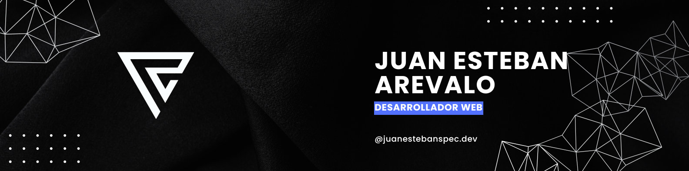

Upwork | UI/UX | Freelancer⭐

    

<h2>Hey 👋, Soy <a href="">Juan Esteban</a></h2>

Desarrollador web con 2+ años de experiencia en análisis y desarrollo de software en Colombia.

He trabajado en empresas donde fortalecí mis habilidades como Front-End Developer, adquiriendo sólidos conocimientos en desarrollo web y creciendo profesionalmente en entornos colaborativos.

 

Además, he trabajado como desarrollador web freelance a través de la plataforma Upwork, acumulando más de un año de experiencia en proyectos para diversas empresas, lo que me ha permitido adaptarme a distintos retos y necesidades del cliente.

 

<h2>⚡️ Algunos datos rapidos</h2>

<ul>
  <li>👻 Actualmente estoy trabajando como desarrollador junior.</li>
  <li>👨‍💻 Puedes ver algunos Pens que subo en <a href="https://codepen.io/Juan-Esteban-Ar-valo" target="_blank">Codepen</a></li>
  <li>💬 Paso mi tiempo codificando y creando cosas nuevas, especialmente cuando pueden ayudarme a mí y a los demás desarrolladores.</li>
  <li>🔎 Actualmente estoy estudiando Análisis y Desarrollo de Software.</li>
  <li>🎉 Curiosidades: ¡Me encanta el ciclismo de montaña!</li>
</ul>
 

## <b> Skills</b>
  

  
  
  
  
  
  
  
  
  
  
  
  
  
  
  
  
  
  

   

  

## Recursos y Herramientas

