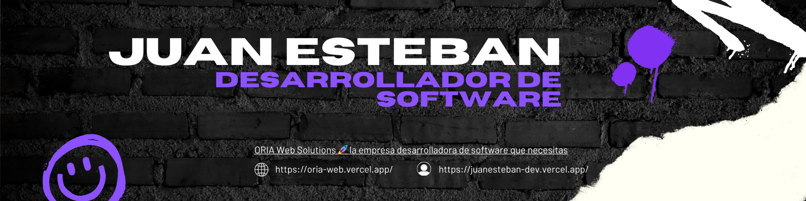

    

<h2>Hey 👋, Soy <a href="">Juan Esteban</a></h2>

Soy un creador de experiencias en línea que se esfuerza por combinar un diseño atractivo con una funcionalidad impecable. Disfruto especialmente trabajar en tecnologías como HTML, CSS y JavaScript para crear interfaces únicas y cautivadoras🎯.

     
    

<h2>⚡️ Algunos datos rapidos</h2>

<ul>
  <li>👻 Actualmente estoy trabajando como desarrollador junior.</li>
  <li>👨‍💻 Puedes ver algunos Pens que subo en <a href="https://codepen.io/Juan-Esteban-Ar-valo" target="_blank">Codepen</a></li>
  <li>💬 Paso mi tiempo codificando y creando cosas nuevas, especialmente cuando pueden ayudarme a mí y a los demás desarrolladores.</li>
  <li>🔎 Actualmente estoy estudiando Análisis y Desarrollo de Software.</li>
  <li>🎉 Curiosidades: ¡Me encanta el ciclismo de montaña!</li>
</ul>
 

## <b> Skills</b>
  
- 💻 &nbsp;
  
  
  

- 🌐 &nbsp;
  
  
  
  
  
  

- 🛢 &nbsp;
  
  
  

- ⚙️ &nbsp;
  
  
  

- 🎨 &nbsp;
  

- 🚀 &nbsp;
  
  

## Recursos y Herramientas

